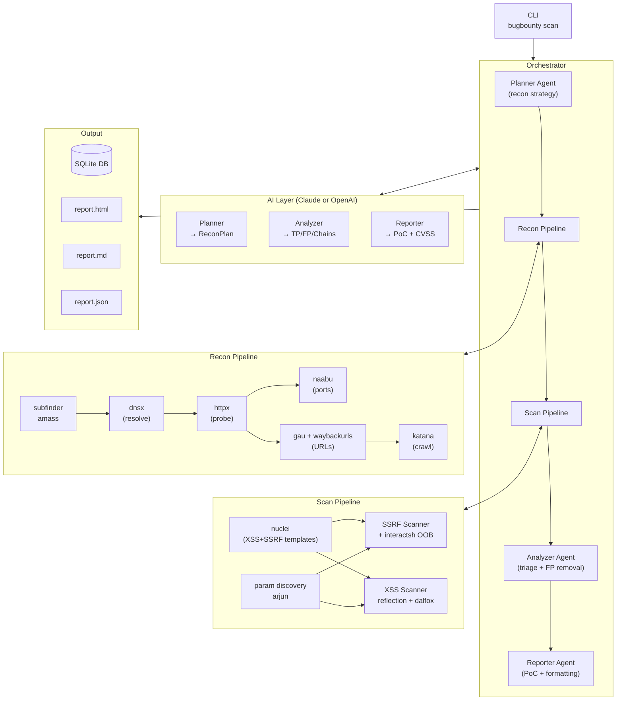
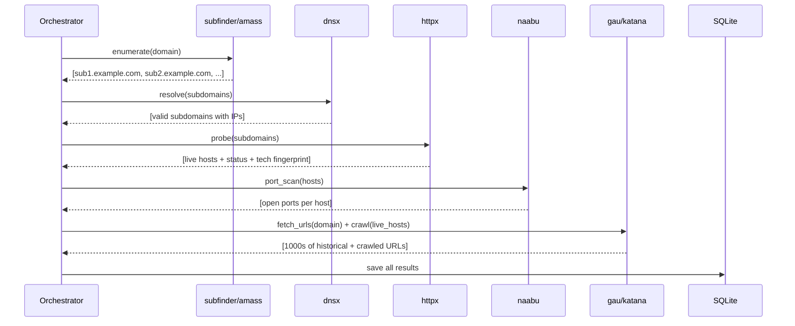
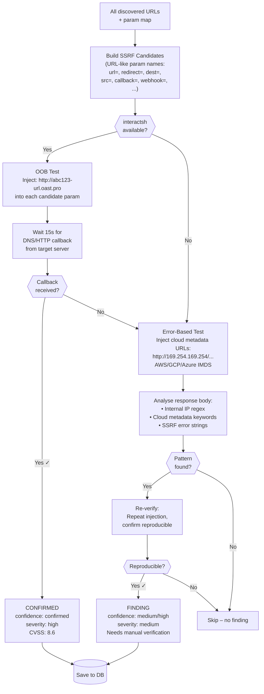
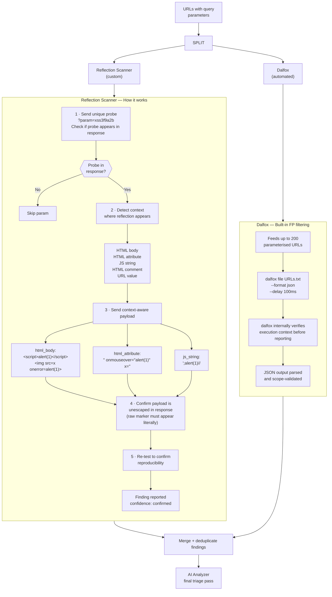
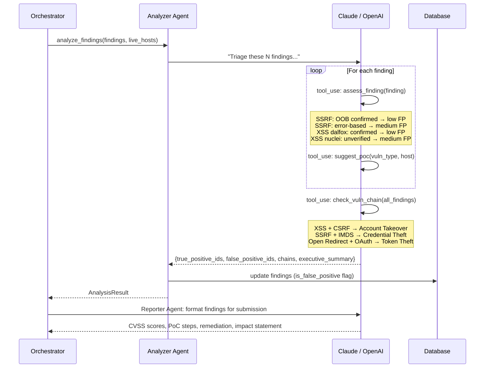
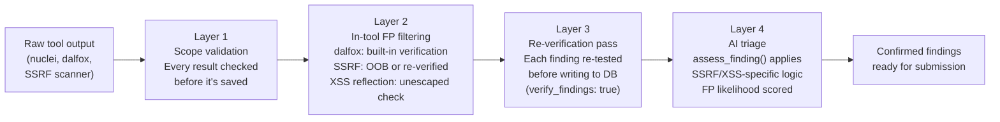

# BugBounty Agent

> AI-powered SSRF and XSS hunting framework for unauthenticated bug bounty targets.

Automates the full pipeline from subdomain discovery to confirmed vulnerability reporting, using Claude or OpenAI as the reasoning engine and purpose-built tools for minimal false positives.

---

## Table of Contents

- [Overview](#overview)
- [Architecture](#architecture)
- [How It Works](#how-it-works)
  - [Recon Phase](#recon-phase)
  - [SSRF Detection](#ssrf-detection)
  - [XSS Detection](#xss-detection)
  - [AI Analysis](#ai-analysis)
- [Requirements](#requirements)
- [Installation](#installation)
- [Configuration](#configuration)
  - [AI Provider](#ai-provider)
  - [Scope](#scope)
  - [SSRF Settings](#ssrf-settings)
  - [XSS Settings](#xss-settings)
- [Usage](#usage)
- [False Positive Minimisation](#false-positive-minimisation)
- [Output & Reports](#output--reports)
- [Project Structure](#project-structure)

---

## Overview

```
bugbounty scan --config my-target.yaml
```

```
  ____              ____                  _         _    ___
 | __ ) _   _  __ | __ )  ___  _   _ _ __ | |_ _   _| |  / _ \
 |  _ \| | | |/ _` |  _ \ / _ \| | | | '_ \| __| | | | | | | |
 | |_) | |_| | (_| | |_) | (_) | |_| | | | | |_| |_| | | |_| |
 |____/ \__,_|\__, |____/ \___/ \__,_|_| |_|\__|\__, |_|\___/
              |___/                              |___/

  AI-Powered Bug Bounty Automation Framework v0.1.0

┌─ Scan Configuration ─────────────────────────────┐
│ Target:     api.example.com                       │
│ Programme:  Example Bug Bounty                    │
│ Platform:   HackerOne                             │
│ Scan ID:    3f2a1b9c-...                          │
│ Model:      claude-opus-4-6  (provider: claude)   │
└───────────────────────────────────────────────────┘

 Phase 1: Reconnaissance
 ⠸ Reconnaissance  [0:02:14]

 Recon complete: 47 subdomains, 31 live hosts, 284 ports, 1,832 URLs

──────────── Phase 2: SSRF + XSS Scanning ────────────

 Scan complete: 6 findings (SSRF: 2, XSS: 3, Nuclei: 1) (3 high, 3 medium)

──────────── Phase 3: AI Analysis ────────────
 ⠼ AI Analyzer triaging findings...

──────────── Scan Summary ────────────
 Findings by Severity
 ┌──────────┬───────┬─────────────────┐
 │ Severity │ Count │ False Positives  │
 ├──────────┼───────┼─────────────────┤
 │ High     │ 4     │ 1               │
 │ Medium   │ 2     │ 1               │
 └──────────┴───────┴─────────────────┘

 Reports generated:
   html:     ./results/3f2a1b9c.../report.html
   markdown: ./results/3f2a1b9c.../report.md
   json:     ./results/3f2a1b9c.../report.json
```

**What it finds (unauthenticated only):**
- **SSRF** — Server-side request forgery via URL parameters, with OOB confirmation via interactsh
- **XSS** — Reflected XSS via context-aware payload testing and dalfox

**What makes it different:**
- OOB (out-of-band) DNS/HTTP callbacks for SSRF — only confirmed findings are reported
- Unescaped reflection detection for XSS — payload must appear literally in the HTML, not just reflected with encoding
- Every finding is re-tested before being written to the database
- AI triage pass removes remaining false positives and adds PoC steps

---

## Architecture



---

## How It Works

### Recon Phase

The framework enumerates all subdomains for the target domain, validates which ones are live, and builds a comprehensive URL database before any vulnerability scanning starts.



**What gets discovered:**
- All resolvable subdomains and their IP addresses
- Live HTTP/HTTPS services with status codes, page titles, and detected technologies (React, Spring Boot, nginx, etc.)
- Open ports beyond 80/443
- Historical URLs from Wayback Machine, Common Crawl, OTX, URLScan
- Crawled application paths and parameters

---

### SSRF Detection

SSRF (Server-Side Request Forgery) is the primary focus. The scanner uses a layered approach designed to produce only confirmed findings.



**SSRF parameter list (top 20 of 40+ tested):**

| Priority | Parameters |
|----------|-----------|
| **Highest** | `url`, `redirect`, `dest`, `callback`, `webhook` |
| **High** | `src`, `href`, `path`, `uri`, `next`, `fetch`, `proxy` |
| **Medium** | `target`, `resource`, `host`, `from`, `to`, `feed`, `load` |
| **Also tested** | `ref`, `location`, `continue`, `goto`, `redir`, `endpoint` |

**Evidence types and confidence levels:**

| Evidence | Type | Confidence | What it means |
|----------|------|-----------|---------------|
| DNS/HTTP callback received | `oob_interaction` | **Confirmed** | Target server made a request to your OOB server — definitive proof |
| Internal IP in response | `internal_ip_leak` | **High** | Response body contains RFC 1918 address — server reached internal network |
| Cloud metadata content | `metadata_content` | **High** | Response contains IMDS keywords — potential credential access |
| SSRF error message | `error_message` | **Medium** | Error suggests outbound connection attempt — requires manual verification |

---

### XSS Detection

XSS scanning uses two parallel approaches, both designed to minimise false positives by requiring proof of unescaped execution context rather than just reflection.



**Context detection example:**

```
Input reflects at position 842 in response:
  Before: <input type="text" value="
  Probe:  xss3f9a2b
  After:  " class="search">

Detected context: html_attribute
Selected payload: " onmouseover="alert(1)" x="

Test URL: /search?q=%22+onmouseover%3D%22alert%281%29%22+x%3D%22
Response check: onmouseover appears unescaped → CONFIRMED
```

---

### AI Analysis

After automated scanning, an AI agent triages all findings, removes false positives, and formats surviving findings for bug bounty submission.



**Provider-agnostic tool-use loop:**

Both Claude and OpenAI use the same agentic loop logic. The `LLMProvider` abstraction normalises their different wire formats:

```
Claude:   stop_reason="tool_use" → content[].type="tool_use"
OpenAI:   finish_reason="tool_calls" → message.tool_calls[]

Both normalised to → NormalizedResponse(tool_calls=[NormalizedToolUse(...)])
```

---

## Requirements

### Python

- Python 3.11+

### External tools (all optional — framework degrades gracefully)

| Tool | Purpose | Install |
|------|---------|---------|
| `subfinder` | Passive subdomain enumeration | `go install github.com/projectdiscovery/subfinder/v2/cmd/subfinder@latest` |
| `amass` | Active/passive subdomain enumeration | `go install github.com/owasp-amass/amass/v4/...@master` |
| `dnsx` | DNS resolution and validation | `go install github.com/projectdiscovery/dnsx/cmd/dnsx@latest` |
| `httpx` | HTTP probing and tech detection | `go install github.com/projectdiscovery/httpx/cmd/httpx@latest` |
| `naabu` | Port scanning | `go install github.com/projectdiscovery/naabu/v2/cmd/naabu@latest` |
| `nuclei` | Template-based vulnerability scanning | `go install github.com/projectdiscovery/nuclei/v3/cmd/nuclei@latest` |
| `gau` | Historical URL discovery | `go install github.com/lc/gau/v2/cmd/gau@latest` |
| `katana` | Web crawler | `go install github.com/projectdiscovery/katana/cmd/katana@latest` |
| `waybackurls` | Wayback Machine URL fetcher | `go install github.com/tomnomnom/waybackurls@latest` |
| **`dalfox`** | **XSS scanner (primary)** | `go install github.com/hahwul/dalfox/v2@latest` |
| **`interactsh-client`** | **SSRF OOB callback server** | `go install github.com/projectdiscovery/interactsh/cmd/interactsh-client@latest` |
| **`arjun`** | **Hidden parameter discovery** | `pip install arjun` |

> **Minimum for SSRF/XSS hunting:** `httpx`, `dalfox`, `interactsh-client`, `gau` or `katana`

After installing nuclei, update templates:
```bash
nuclei -update-templates
```

---

## Installation

```bash
# Clone or download
cd bugbounty-agent

# Install Python dependencies
pip install -e .

# Set API keys
cp .env.example .env
# Edit .env and add your key(s)

# Verify tools
bugbounty check-tools
```

```
Tool Availability
┌───────────────────┬──────────┬──────────────────────────────────┬───────────┐
│ Tool              │ Category │ Purpose                          │ Status    │
├───────────────────┼──────────┼──────────────────────────────────┼───────────┤
│ subfinder         │ RECON    │ Subdomain enumeration            │ Installed │
│ dalfox            │ XSS      │ XSS scanner (primary)            │ Installed │
│ interactsh-client │ SSRF     │ OOB interaction server (SSRF)    │ Installed │
│ arjun             │ PARAMS   │ Hidden parameter discovery       │ Not found │
│ nuclei            │ SCANNING │ Template-based vuln scanner      │ Installed │
└───────────────────┴──────────┴──────────────────────────────────┴───────────┘

API Keys
┌────────────────────┬────────────┐
│ Provider           │ Status     │
├────────────────────┼────────────┤
│ Claude (Anthropic) │ Configured │
│ OpenAI             │ Not set    │
└────────────────────┴────────────┘
```

---

## Configuration

Copy and edit the example config:

```bash
cp config/config.yaml my-target.yaml
```

### AI Provider

Switch between Claude and OpenAI with a single line:

```yaml
ai:
  provider: "claude"          # Use Anthropic Claude
  claude_model: "claude-opus-4-6"

  # --- OR ---

  provider: "openai"          # Use OpenAI
  openai_model: "gpt-4o"

  max_tokens: 8192
  temperature: 0
```

Set the corresponding key in `.env`:

```bash
# For Claude
ANTHROPIC_API_KEY=sk-ant-...

# For OpenAI
OPENAI_API_KEY=sk-...
```

### Scope

Always define scope before running. The framework scope-validates every target before testing — nothing outside scope is ever touched.

```yaml
scope:
  in_scope:
    - "*.example.com"          # wildcard – matches all subdomains
    - "example.com"            # exact domain
    - "api.example.com"        # explicit subdomain
  out_of_scope:
    - "blog.example.com"       # excluded even if matched by wildcard above
    - "status.example.com"
  ip_ranges:
    - "10.0.0.0/8"             # CIDR ranges (optional)
```

> Out-of-scope rules always take precedence over in-scope wildcards.

### SSRF Settings

```yaml
vuln:
  ssrf:
    enabled: true

    # OOB interaction server
    # oast.pro is the free public interactsh server
    # Self-host with: docker run -it projectdiscovery/interactsh-server
    interactsh_server: "oast.pro"

    # How long to wait for a DNS/HTTP callback after injecting a payload
    # Increase if the target has slow outbound DNS resolution
    oob_wait_seconds: 15.0

    concurrent: 5              # parallel candidate tests
    timeout: 10.0              # per-request timeout in seconds
    verify_findings: true      # re-test each finding before saving (recommended)

    # Extra parameter names to test beyond the built-in list of 40+
    extra_params:
      - "service_url"
      - "integration_endpoint"
```

### XSS Settings

```yaml
vuln:
  xss:
    enabled: true
    dalfox_enabled: true             # primary XSS scanner
    reflection_scanner_enabled: true  # custom unescaped-reflection detector
    verify_findings: true            # re-test before saving (recommended)
    concurrent: 5
    timeout: 10.0

    # Blind XSS: get a free URL from https://xsshunter.com
    # When set, dalfox injects your callback URL for stored/blind XSS
    blind_xss_url: "https://your-id.xss.ht"
```

---

## Usage

### Full scan

```bash
bugbounty scan --config my-target.yaml
```

### Override target domain

```bash
bugbounty scan --config my-target.yaml --domain api.othertarget.com
```

### Recon only (no vulnerability scanning)

```bash
bugbounty scan --config my-target.yaml --only-recon
```

### Scan only (reuse existing recon)

```bash
# After a prior scan with --only-recon:
bugbounty scan --config my-target.yaml --only-scan --resume <SCAN_ID>
```

### Resume an interrupted scan

```bash
bugbounty scan --config my-target.yaml --resume 3f2a1b9c-...
```

### List all previous scans

```bash
bugbounty list-scans --config my-target.yaml
```

```
Scan Runs
┌──────────────────┬──────────────┬─────────────────────┬───────────┐
│ ID               │ Target       │ Started             │ Status    │
├──────────────────┼──────────────┼─────────────────────┼───────────┤
│ 3f2a1b9c-...     │ example.com  │ 2026-02-26 09:14:32 │ completed │
│ 1a7e4c2d-...     │ example.com  │ 2026-02-25 17:03:11 │ failed    │
└──────────────────┴──────────────┴─────────────────────┴───────────┘
```

### Regenerate a report

```bash
bugbounty report 3f2a1b9c-... --config my-target.yaml --format html
```

### Verbose mode (show all tool output)

```bash
bugbounty scan --config my-target.yaml --verbose
```

---

## False Positive Minimisation

This is a first-class concern. Every layer of the pipeline applies FP reduction:



**Confidence scoring used by the AI analyzer:**

| Signal | Confidence adjustment |
|--------|----------------------|
| OOB DNS/HTTP callback received | +3 (definitive) |
| Dalfox confirmed (built-in verification) | +2 |
| Unescaped reflection in known HTML context | +2 |
| Internal IP found in response body | +2 |
| Error-based SSRF (not reproducible) | +1 FP indicator |
| Nuclei XSS without payload confirmation | +1 FP indicator |
| Informational/detection nuclei template | +2 FP indicators |
| Generic/detect tag | +1 FP indicator |

Net score ≥ 2 → `fp_likelihood: low` → reported
Net score ≤ 0 → `fp_likelihood: high` → discarded

---

## Output & Reports

Each scan produces three report formats in `./results/<scan-id>/`:

### HTML Report

A self-contained Bootstrap 5 report with:
- Executive summary and statistics cards
- Per-finding cards with colour-coded severity borders
- Numbered PoC reproduction steps
- Remediation guidance
- Vulnerability chain highlights
- Filterable findings table by severity

```
results/
└── 3f2a1b9c-4a2b-4c3d-8e5f-6a7b8c9d0e1f/
    ├── report.html     ← main report (open in browser)
    ├── report.md       ← markdown (paste into Jira/Confluence)
    └── report.json     ← machine-readable (integrate with other tools)
```

### JSON Schema

Each finding in `report.json`:

```json
{
  "id": "uuid",
  "template_id": "ssrf-oob_interaction",
  "name": "Server-Side Request Forgery (SSRF)",
  "severity": "high",
  "cvss_score": 8.6,
  "host": "https://api.example.com",
  "matched_at": "https://api.example.com/fetch?url=...",
  "description": "SSRF via parameter 'url'. OOB HTTP callback received.",
  "tags": ["ssrf", "oob"],
  "confidence": "confirmed",
  "evidence_type": "oob_interaction",
  "poc_steps": [
    "1. Navigate to: https://api.example.com/fetch",
    "2. Set up an interactsh listener: interactsh-client",
    "3. Inject your OOB URL into the 'url' parameter: ?url=http://abc123.oast.pro",
    "4. Observe DNS/HTTP callback confirming SSRF",
    "5. Escalate: inject http://169.254.169.254/latest/meta-data/ for AWS credential access"
  ],
  "remediation": "Implement a strict allowlist of permitted URLs/domains...",
  "is_false_positive": false
}
```

---

## Project Structure

```
bugbounty-agent/
│
├── config/
│   └── config.yaml              # example configuration
│
├── bugbounty/
│   ├── core/
│   │   ├── config.py            # Pydantic config models + YAML loader
│   │   ├── scope.py             # ScopeValidator (wildcard + CIDR support)
│   │   ├── rate_limiter.py      # Semaphore + token-bucket rate limiting
│   │   ├── llm.py               # LLM provider abstraction (Claude + OpenAI)
│   │   └── interactsh.py        # OOB callback client for SSRF confirmation
│   │
│   ├── tools/
│   │   ├── base.py              # BaseTool: subprocess runner, scope check, timing
│   │   ├── recon.py             # subfinder, amass, dnsx, httpx, naabu
│   │   ├── scanner.py           # nuclei (XSS+SSRF template focus)
│   │   ├── params.py            # ParamExtractor + arjun wrapper
│   │   ├── ssrf.py              # SSRFScanner (OOB + error-based + re-verify)
│   │   ├── xss.py               # ReflectionScanner + DalfoxScanner
│   │   ├── fuzzer.py            # ffuf, dalfox (legacy)
│   │   └── discovery.py         # gau, katana, waybackurls
│   │
│   ├── agents/
│   │   ├── base.py              # BaseAgent: provider-agnostic agentic loop
│   │   ├── planner.py           # PlannerAgent → ReconPlan
│   │   ├── analyzer.py          # AnalyzerAgent → triage, FP removal, chains
│   │   └── reporter.py          # ReporterAgent → PoC, CVSS, remediation
│   │
│   ├── pipeline/
│   │   ├── recon.py             # ReconPipeline: subdomain → live hosts → URLs
│   │   ├── scan.py              # ScanPipeline: nuclei → params → SSRF → XSS
│   │   └── orchestrator.py      # Orchestrator: end-to-end coordinator
│   │
│   ├── db/
│   │   ├── models.py            # Pydantic models: Finding, LiveHost, ScanRun, ...
│   │   └── store.py             # DataStore: aiosqlite CRUD + deduplication
│   │
│   ├── reporting/
│   │   ├── generator.py         # ReportGenerator: Jinja2 → HTML/MD/JSON
│   │   └── templates/
│   │       ├── report.html.j2   # Bootstrap 5 HTML report
│   │       └── report.md.j2     # GitHub-flavoured Markdown report
│   │
│   └── main.py                  # Click CLI: scan, report, list-scans, check-tools
│
├── results/                     # Scan output (gitignored)
├── pyproject.toml
├── requirements.txt
└── .env.example
```

---

## Safety & Ethics

This framework is designed exclusively for **authorised security testing**:

- **Scope enforcement is mandatory** — every tool call scope-validates its target before execution. The `ScopeValidator` runs on every subdomain, URL, and scan result.
- **Only unauthenticated vectors** — no session tokens, cookies, or credentials are used or tested.
- **Non-destructive** — no DoS templates, no write operations, no data modification.
- **Rate limiting** — all tools run with configurable rate limits to avoid service disruption.

Only run this against targets where you have explicit written authorisation (bug bounty programme scope or signed penetration testing agreement).
