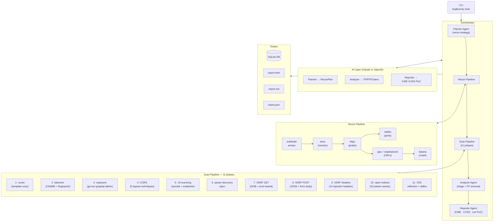
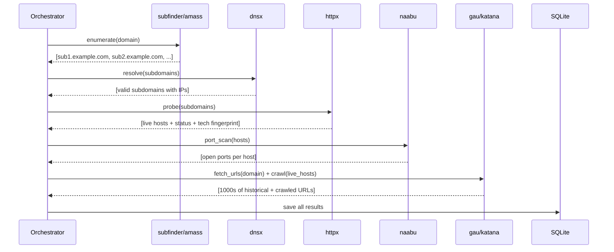
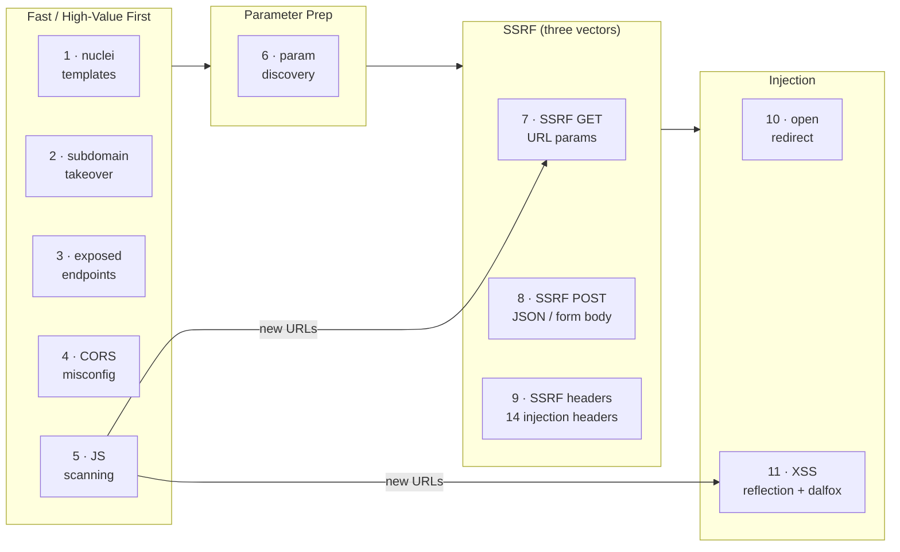
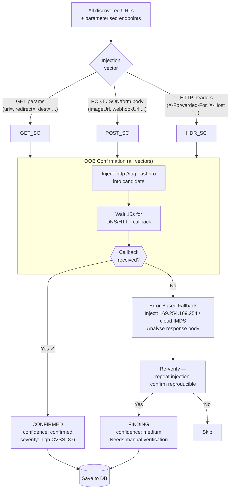
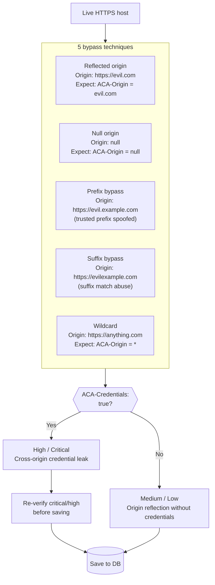
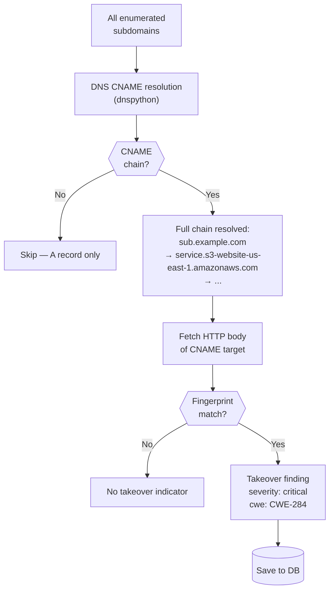
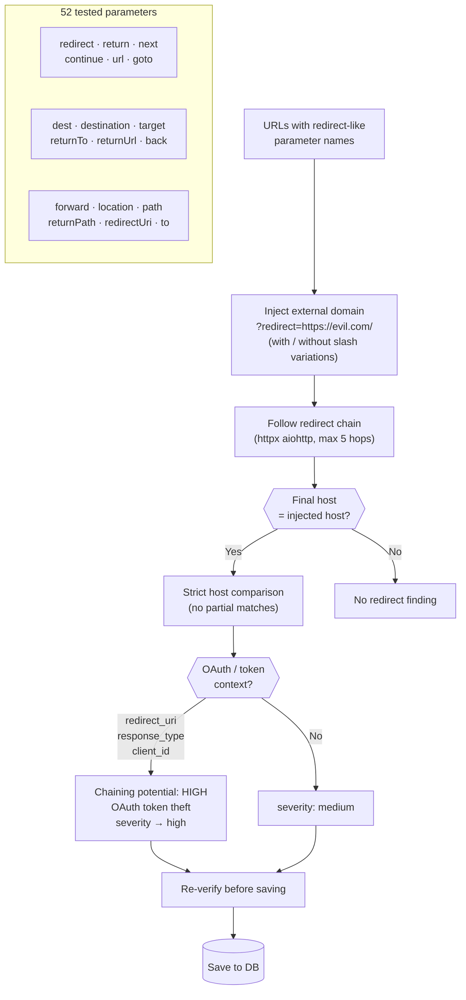
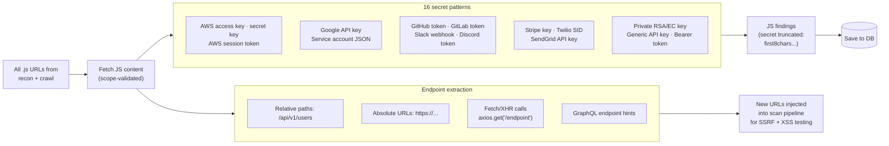
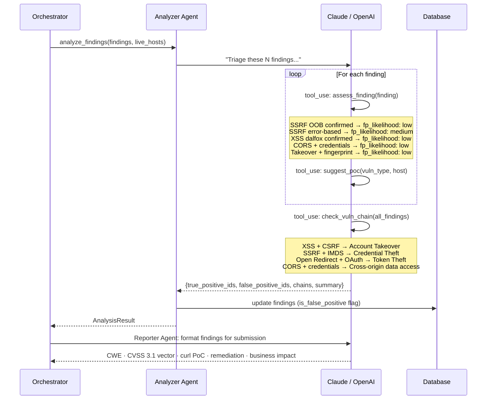
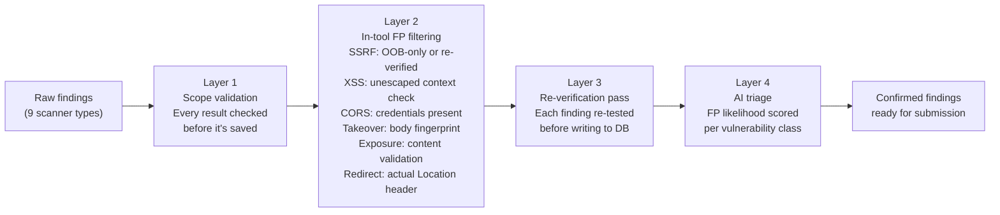

# BugBounty Agent

> AI-powered vulnerability hunting framework for unauthenticated bug bounty targets.

Automates the full pipeline from subdomain discovery to confirmed vulnerability reporting, using Claude or OpenAI as the reasoning engine and purpose-built scanners for nine vulnerability classes with minimal false positives.

---

## Table of Contents

- [Overview](#overview)
- [Architecture](#architecture)
- [How It Works](#how-it-works)
  - [Recon Phase](#recon-phase)
  - [Scan Pipeline (11 Phases)](#scan-pipeline-11-phases)
  - [SSRF Detection (GET + POST + Headers)](#ssrf-detection-get--post--headers)
  - [XSS Detection](#xss-detection)
  - [CORS Misconfiguration](#cors-misconfiguration)
  - [Subdomain Takeover](#subdomain-takeover)
  - [Open Redirect Detection](#open-redirect-detection)
  - [JavaScript Secret Scanning](#javascript-secret-scanning)
  - [Exposed Endpoint Detection](#exposed-endpoint-detection)
  - [AI Analysis](#ai-analysis)
- [Requirements](#requirements)
- [Installation](#installation)
- [Configuration](#configuration)
  - [AI Provider](#ai-provider)
  - [Scope](#scope)
  - [SSRF Settings](#ssrf-settings)
  - [XSS Settings](#xss-settings)
  - [CORS Settings](#cors-settings)
  - [Subdomain Takeover Settings](#subdomain-takeover-settings)
  - [Open Redirect Settings](#open-redirect-settings)
  - [JS Scanner Settings](#js-scanner-settings)
  - [Exposed Endpoint Settings](#exposed-endpoint-settings)
- [Usage](#usage)
- [False Positive Minimisation](#false-positive-minimisation)
- [Output & Reports](#output--reports)
- [Project Structure](#project-structure)

---

## Overview

```
bugbounty scan --config my-target.yaml
```

```
  ____              ____                  _         _    ___
 | __ ) _   _  __ | __ )  ___  _   _ _ __ | |_ _   _| |  / _ \
 |  _ \| | | |/ _` |  _ \ / _ \| | | | '_ \| __| | | | | | | |
 | |_) | |_| | (_| | |_) | (_) | |_| | | | | |_| |_| | | |_| |
 |____/ \__,_|\__, |____/ \___/ \__,_|_| |_|\__|\__, |_|\___/
              |___/                              |___/

  AI-Powered Bug Bounty Automation Framework v0.1.0

┌─ Scan Configuration ──────────────────────────────────┐
│ Target:     api.example.com                            │
│ Programme:  Example Bug Bounty                         │
│ Platform:   HackerOne                                  │
│ Scan ID:    3f2a1b9c-...                               │
│ Model:      claude-opus-4-6  (provider: claude)        │
│ Coverage:   SSRF·XSS·CORS·Takeover·Redirect·JS·Expose │
└────────────────────────────────────────────────────────┘

 Phase 1: Reconnaissance
 ⠸ Reconnaissance  [0:02:14]

 Recon complete: 47 subdomains, 31 live hosts, 284 ports, 1,832 URLs

──────────── Phase 2: Vulnerability Scanning (11 phases) ────────────

 [1/11] nuclei               ████████████ done
 [2/11] subdomain-takeover   ████████████ done  — 1 takeover candidate
 [3/11] exposed-endpoints    ████████████ done  — 3 exposures
 [4/11] cors-scan            ████████████ done  — 2 CORS issues
 [5/11] js-scanning          ████████████ done  — 4 secrets, 12 new URLs
 [6/11] param-discovery      ████████████ done
 [7/11] ssrf-get             ████████████ done  — 2 SSRF confirmed
 [8/11] ssrf-post            ████████████ done  — 1 SSRF (JSON body)
 [9/11] header-ssrf          ████████████ done
 [10/11] open-redirect       ████████████ done  — 1 redirect (OAuth chain)
 [11/11] xss                 ████████████ done  — 3 XSS confirmed

 Scan complete: 14 findings
   SSRF (GET): 2 · SSRF (POST): 1 · SSRF (Headers): 0
   XSS: 3 · CORS: 2 · Takeover: 1 · Redirect: 1 · Exposure: 3 · Nuclei: 1

──────────── Phase 3: AI Analysis ────────────
 ⠼ AI Analyzer triaging 14 findings...

──────────── Scan Summary ────────────
 Findings by Vulnerability Type
 ┌──────────────────┬───────┬──────────┬────────────────┐
 │ Type             │ Count │ Severity │ False Positives │
 ├──────────────────┼───────┼──────────┼────────────────┤
 │ SSRF             │ 3     │ high     │ 0              │
 │ XSS              │ 3     │ medium   │ 1              │
 │ CORS             │ 2     │ medium   │ 0              │
 │ Subdomain Tkover │ 1     │ critical │ 0              │
 │ Open Redirect    │ 1     │ medium   │ 0              │
 │ Exposed Endpoint │ 2     │ high     │ 1              │
 │ Nuclei           │ 1     │ medium   │ 1              │
 └──────────────────┴───────┴──────────┴────────────────┘
```

**What it finds (unauthenticated):**

| Vulnerability | Method | Confirmation |
|---|---|---|
| **SSRF (GET params)** | 40+ URL-like parameters | OOB DNS/HTTP callback |
| **SSRF (POST body)** | 36 JSON/form field names | OOB DNS/HTTP callback |
| **SSRF (HTTP headers)** | 14 headers (X-Forwarded-For, etc.) | OOB or reflection |
| **XSS (reflected)** | Context-aware payloads + dalfox | Unescaped in response |
| **CORS misconfiguration** | 5 bypass techniques | Credentials + origin |
| **Subdomain takeover** | CNAME chain + 20+ service fingerprints | Body fingerprint match |
| **Open redirect** | 52 redirect parameter names | Actual Location header |
| **JS secret scanning** | 16 patterns (API keys, tokens, URLs) | Regex match in .js files |
| **Exposed endpoints** | 70+ paths across 8 categories | Content validation |

**What makes it different:**
- OOB (out-of-band) DNS/HTTP callbacks for SSRF — only confirmed findings are reported
- Unescaped reflection detection for XSS — payload must appear literally in HTML
- Every finding is re-tested before being written to the database
- JS scanner feeds newly discovered endpoints back into the scan pipeline
- AI triage removes remaining false positives and detects vulnerability chains
- Reports include CWE IDs, CVSS 3.1 vectors, and ready-to-use `curl` PoC commands

---

## Architecture



---

## How It Works

### Recon Phase

The framework enumerates all subdomains for the target domain, validates which ones are live, and builds a comprehensive URL database before any vulnerability scanning starts.



**What gets discovered:**
- All resolvable subdomains and their IP addresses
- Live HTTP/HTTPS services with status codes, page titles, and detected technologies (React, Spring Boot, nginx, etc.)
- Open ports beyond 80/443
- Historical URLs from Wayback Machine, Common Crawl, OTX, URLScan
- Crawled application paths and parameters

---

### Scan Pipeline (11 Phases)

The scan pipeline runs in a fixed order designed to maximise coverage and feed results from early phases into later ones. JS scanning, for example, discovers new URLs that feed into the SSRF and XSS phases.



---

### SSRF Detection (GET + POST + Headers)

SSRF is tested across three distinct injection vectors. All three share the same OOB-first confirmation strategy.



**GET SSRF — tested parameter names (40+ total):**

| Priority | Parameters |
|----------|-----------|
| **Highest** | `url`, `redirect`, `dest`, `callback`, `webhook` |
| **High** | `src`, `href`, `path`, `uri`, `next`, `fetch`, `proxy` |
| **Medium** | `target`, `resource`, `host`, `from`, `to`, `feed`, `load` |
| **Also tested** | `ref`, `location`, `continue`, `goto`, `redir`, `endpoint` |

**POST SSRF — tested field names (36 total):**

| Category | Fields |
|----------|--------|
| **Image/media** | `imageUrl`, `image_url`, `avatarUrl`, `logoUrl`, `thumbnailUrl` |
| **Webhooks** | `webhookUrl`, `webhook_url`, `callbackUrl`, `notifyUrl` |
| **Remote access** | `remoteUrl`, `remote_url`, `fileUrl`, `pdfUrl`, `xmlUrl` |
| **Integration** | `apiEndpoint`, `serviceUrl`, `targetUrl`, `importUrl` |

**Header SSRF — tested headers (14 total):**

```
X-Forwarded-For    X-Forwarded-Host   X-Real-IP
X-Original-URL     X-Rewrite-URL      X-Host
X-Custom-IP-Authorization             Forwarded
True-Client-IP     Client-IP          X-Client-IP
X-Remote-IP        X-Remote-Addr      X-Originating-IP
```

---

### XSS Detection

XSS scanning uses two parallel approaches, both designed to minimise false positives by requiring proof of unescaped execution context.

```mermaid
flowchart TD
    URLS["URLs with query\nparameters"] --> SPLIT

    SPLIT --> REFL["Reflection Scanner\n(custom)"]
    SPLIT --> DALF["Dalfox\n(automated)"]

    subgraph REFLECTION["Reflection Scanner"]
        direction TB
        PROBE["1 · Send unique probe\n?param=xss3f9a2b\nCheck if probe appears in response"]
        PROBE --> FOUND_R{{"Probe in\nresponse?"}}
        FOUND_R -->|No| SKIP_R["Skip param"]
        FOUND_R -->|Yes| CTX["2 · Detect context\nwhere reflection appears"]
        CTX --> CONTEXTS["HTML body · HTML attribute\nJS string · HTML comment · URL value"]
        CONTEXTS --> PAYLOAD["3 · Send context-aware payload"]
        PAYLOAD --> HTML_P["html_body:\n<script>alert(1)</script>\n"]
        PAYLOAD --> ATTR_P["html_attribute:\n\" onmouseover=\"alert(1)\" x=\""]
        PAYLOAD --> JS_P["js_string:\n';alert(1)//"]
        HTML_P & ATTR_P & JS_P --> UNESC["4 · Confirm payload is\nunescaped in response\n(raw marker must appear literally)"]
        UNESC --> VERIFY_R["5 · Re-test to confirm\nreproducibility"]
    end

    subgraph DALFOX_FLOW["Dalfox"]
        direction TB
        D1["Feeds up to 200\nparameterised URLs"]
        D1 --> D2["dalfox file URLs.txt\n--format json --delay 100ms"]
        D2 --> D3["dalfox internally verifies\nexecution context before reporting"]
        D3 --> D4["JSON output parsed\nand scope-validated"]
    end

    REFL --> REFLECTION
    DALF --> DALFOX_FLOW
    REFLECTION --> MERGE["Merge + deduplicate"]
    DALFOX_FLOW --> MERGE
    MERGE --> AI_XSS["AI Analyzer\nfinal triage pass"]
```

---

### CORS Misconfiguration

The CORS scanner tests five distinct bypass techniques. Any misconfiguration that returns `Access-Control-Allow-Credentials: true` is elevated to high/critical.



**Severity matrix:**

| Bypass Type | With Credentials | Without Credentials |
|---|---|---|
| Reflected origin | **Critical** | Medium |
| Null origin | **High** | Low |
| Prefix/Suffix bypass | **High** | Medium |
| Wildcard | Low (by design) | Info |

---

### Subdomain Takeover

The takeover scanner resolves the full CNAME chain for each subdomain and checks whether the final target is an unclaimed service using 20+ provider fingerprints.



**Supported providers (20+ fingerprints):**

| Cloud / CDN | SaaS / Hosting |
|---|---|
| AWS S3, CloudFront | GitHub Pages, Netlify, Vercel |
| Azure Blob / Traffic Manager | Fastly, Heroku, Shopify |
| Pantheon, WP Engine | Zendesk, Freshdesk, HubSpot |
| Tumblr, Ghost, Cargo | Surge.sh, ReadTheDocs, Statuspage |

---

### Open Redirect Detection

The redirect scanner tests 52 parameter names, follows the actual redirect chain, and detects OAuth token-theft chaining potential.



---

### JavaScript Secret Scanning

Every `.js` file discovered during recon is fetched and scanned for hardcoded secrets and hidden endpoints. Newly discovered endpoints are fed back into the SSRF and XSS phases.



**What gets redacted in findings:**
Secrets are truncated to the first 8 characters followed by `...` — enough to confirm the finding without storing the full secret in the database.

---

### Exposed Endpoint Detection

Eight categories of common sensitive path exposure are checked, with content-based validation to eliminate `200 OK` false positives from custom error pages.

| Category | Example paths | Content validation |
|---|---|---|
| **git** | `/.git/config`, `/.git/HEAD` | Must contain `[core]` |
| **env** | `/.env`, `/.env.production` | Must contain `KEY=VALUE` |
| **api_docs** | `/swagger.json`, `/openapi.yaml`, `/graphql` | Must contain OpenAPI markers or GraphQL schema |
| **graphql** | `/graphql`, `/api/graphql` | Sends introspection query, must return `__schema` |
| **spring_actuator** | `/actuator/env`, `/actuator/beans` | Must contain `activeProfiles` or `beans` |
| **debug** | `/debug`, `/phpinfo.php`, `/server-info` | Must contain debug-specific keywords |
| **backup** | `/.DS_Store`, `/backup.zip`, `/db.sql.gz` | File type / size validation |
| **admin** | `/admin`, `/wp-admin`, `/administrator` | Must not be a generic 200 |

---

### AI Analysis

After automated scanning, an AI agent triages all findings, removes false positives, detects vulnerability chains, and formats surviving findings for bug bounty submission.



**Provider-agnostic tool-use loop:**

Both Claude and OpenAI use the same agentic loop logic. The `LLMProvider` abstraction normalises their different wire formats:

```
Claude:   stop_reason="tool_use" → content[].type="tool_use"
OpenAI:   finish_reason="tool_calls" → message.tool_calls[]

Both normalised to → NormalizedResponse(tool_calls=[NormalizedToolUse(...)])
```

---

## Requirements

### Python

- Python 3.11+

### External tools (all optional — framework degrades gracefully)

| Tool | Purpose | Install |
|------|---------|---------|
| `subfinder` | Passive subdomain enumeration | `go install github.com/projectdiscovery/subfinder/v2/cmd/subfinder@latest` |
| `amass` | Active/passive subdomain enumeration | `go install github.com/owasp-amass/amass/v4/...@master` |
| `dnsx` | DNS resolution and validation | `go install github.com/projectdiscovery/dnsx/cmd/dnsx@latest` |
| `httpx` | HTTP probing and tech detection | `go install github.com/projectdiscovery/httpx/cmd/httpx@latest` |
| `naabu` | Port scanning | `go install github.com/projectdiscovery/naabu/v2/cmd/naabu@latest` |
| `nuclei` | Template-based vulnerability scanning | `go install github.com/projectdiscovery/nuclei/v3/cmd/nuclei@latest` |
| `gau` | Historical URL discovery | `go install github.com/lc/gau/v2/cmd/gau@latest` |
| `katana` | Web crawler | `go install github.com/projectdiscovery/katana/cmd/katana@latest` |
| `waybackurls` | Wayback Machine URL fetcher | `go install github.com/tomnomnom/waybackurls@latest` |
| **`dalfox`** | **XSS scanner (primary)** | `go install github.com/hahwul/dalfox/v2@latest` |
| **`interactsh-client`** | **SSRF OOB callback server** | `go install github.com/projectdiscovery/interactsh/cmd/interactsh-client@latest` |
| **`arjun`** | **Hidden parameter discovery** | `pip install arjun` |

> **Minimum for full coverage:** `httpx`, `dalfox`, `interactsh-client`, `gau`/`katana`
>
> **For SSRF only:** `interactsh-client` + Python aiohttp (built-in)

After installing nuclei, update templates:
```bash
nuclei -update-templates
```

---

## Installation

```bash
# Clone or download
cd bugbounty-agent

# Install Python dependencies
pip install -e .

# Set API keys
cp .env.example .env
# Edit .env and add your key(s)

# Verify tools
bugbounty check-tools
```

```
Tool Availability
┌───────────────────┬───────────────┬──────────────────────────────────────┬───────────┐
│ Tool              │ Category      │ Purpose                              │ Status    │
├───────────────────┼───────────────┼──────────────────────────────────────┼───────────┤
│ subfinder         │ RECON         │ Subdomain enumeration                │ Installed │
│ httpx             │ RECON         │ HTTP probing                         │ Installed │
│ dalfox            │ XSS           │ XSS scanner (primary)                │ Installed │
│ interactsh-client │ SSRF          │ OOB interaction server               │ Installed │
│ arjun             │ PARAMS        │ Hidden parameter discovery           │ Not found │
│ nuclei            │ SCANNING      │ Template-based vuln scanner          │ Installed │
└───────────────────┴───────────────┴──────────────────────────────────────┴───────────┘

API Keys
┌────────────────────┬────────────┐
│ Provider           │ Status     │
├────────────────────┼────────────┤
│ Claude (Anthropic) │ Configured │
│ OpenAI             │ Not set    │
└────────────────────┴────────────┘
```

---

## Configuration

Copy and edit the example config:

```bash
cp config/config.yaml my-target.yaml
```

### AI Provider

Switch between Claude and OpenAI with a single line:

```yaml
ai:
  provider: "claude"          # Use Anthropic Claude
  claude_model: "claude-opus-4-6"

  # --- OR ---

  provider: "openai"          # Use OpenAI
  openai_model: "gpt-4o"

  max_tokens: 8192
  temperature: 0
```

Set the corresponding key in `.env`:

```bash
# For Claude
ANTHROPIC_API_KEY=sk-ant-...

# For OpenAI
OPENAI_API_KEY=sk-...
```

### Scope

Always define scope before running. The framework scope-validates every target before testing — nothing outside scope is ever touched.

```yaml
scope:
  in_scope:
    - "*.example.com"          # wildcard – matches all subdomains
    - "example.com"            # exact domain
    - "api.example.com"        # explicit subdomain
  out_of_scope:
    - "blog.example.com"       # excluded even if matched by wildcard above
    - "status.example.com"
  ip_ranges:
    - "10.0.0.0/8"             # CIDR ranges (optional)
```

> Out-of-scope rules always take precedence over in-scope wildcards.

### SSRF Settings

```yaml
vuln:
  ssrf:
    enabled: true
    interactsh_server: "oast.pro"   # public server; self-host for reliability
    oob_wait_seconds: 15.0          # increase for slow outbound DNS
    concurrent: 5
    timeout: 10.0
    verify_findings: true
    extra_params:
      - "service_url"
      - "integration_endpoint"

  ssrf_post:
    enabled: true
    concurrent: 5
    timeout: 10.0

  header_injection:
    enabled: true
    oob_wait_seconds: 10.0
    concurrent: 3
    timeout: 10.0
```

### XSS Settings

```yaml
vuln:
  xss:
    enabled: true
    dalfox_enabled: true
    reflection_scanner_enabled: true
    verify_findings: true
    concurrent: 5
    timeout: 10.0
    blind_xss_url: "https://your-id.xss.ht"   # optional: https://xsshunter.com
```

### CORS Settings

```yaml
vuln:
  cors:
    enabled: true
    concurrent: 10
    timeout: 10.0
    verify_critical: true           # re-verify high/critical findings
```

### Subdomain Takeover Settings

```yaml
vuln:
  takeover:
    enabled: true
    concurrent: 20
    timeout: 10.0
    dns_timeout: 5.0
```

### Open Redirect Settings

```yaml
vuln:
  open_redirect:
    enabled: true
    concurrent: 10
    timeout: 10.0
    max_redirects: 5
    verify_findings: true
```

### JS Scanner Settings

```yaml
vuln:
  js_scanner:
    enabled: true
    concurrent: 10
    timeout: 15.0
    max_js_size_kb: 2048            # skip minified bundles larger than this
```

### Exposed Endpoint Settings

```yaml
vuln:
  exposure:
    enabled: true
    concurrent: 20
    timeout: 10.0
    categories:
      - git
      - env
      - api_docs
      - graphql
      - spring_actuator
      - debug
      - backup
      - admin
```

---

## Usage

### Full scan

```bash
bugbounty scan --config my-target.yaml
```

### Override target domain

```bash
bugbounty scan --config my-target.yaml --domain api.othertarget.com
```

### Recon only (no vulnerability scanning)

```bash
bugbounty scan --config my-target.yaml --only-recon
```

### Scan only (reuse existing recon)

```bash
# After a prior scan with --only-recon:
bugbounty scan --config my-target.yaml --only-scan --resume <SCAN_ID>
```

### Resume an interrupted scan

```bash
bugbounty scan --config my-target.yaml --resume 3f2a1b9c-...
```

### List all previous scans

```bash
bugbounty list-scans --config my-target.yaml
```

```
Scan Runs
┌──────────────────┬──────────────┬─────────────────────┬───────────┐
│ ID               │ Target       │ Started             │ Status    │
├──────────────────┼──────────────┼─────────────────────┼───────────┤
│ 3f2a1b9c-...     │ example.com  │ 2026-02-26 09:14:32 │ completed │
│ 1a7e4c2d-...     │ example.com  │ 2026-02-25 17:03:11 │ failed    │
└──────────────────┴──────────────┴─────────────────────┴───────────┘
```

### Regenerate a report

```bash
bugbounty report 3f2a1b9c-... --config my-target.yaml --format html
```

### Verbose mode (show all tool output)

```bash
bugbounty scan --config my-target.yaml --verbose
```

---

## False Positive Minimisation

This is a first-class concern. Every layer of the pipeline applies FP reduction, with vulnerability-specific logic for each scanner.



**Confidence scoring by signal type:**

| Signal | Confidence adjustment |
|--------|----------------------|
| OOB DNS/HTTP callback received (SSRF) | +3 (definitive) |
| Dalfox confirmed XSS | +2 |
| Unescaped reflection in known HTML context | +2 |
| CORS with `Access-Control-Allow-Credentials: true` | +2 |
| Subdomain takeover fingerprint matched | +2 |
| Open redirect: actual Location header match | +2 |
| Internal IP found in response body | +2 |
| `.git/config` with `[core]` present | +2 |
| `.env` with `KEY=VALUE` present | +2 |
| JS secret pattern matched | +1 |
| Error-based SSRF (not reproducible) | +1 FP indicator |
| Nuclei XSS without payload confirmation | +1 FP indicator |
| Informational/detection nuclei template | +2 FP indicators |
| CORS without credentials (wildcard) | +1 FP indicator |

Net score ≥ 2 → `fp_likelihood: low` → reported
Net score ≤ 0 → `fp_likelihood: high` → discarded

---

## Output & Reports

Each scan produces three report formats in `./results/<scan-id>/`:

### HTML Report

A self-contained Bootstrap 5 report with:
- Executive summary and statistics cards
- Per-finding cards with colour-coded severity borders
- CWE reference and CVSS 3.1 vector string per finding
- Ready-to-use `curl` PoC command for SSRF, CORS, and redirect findings
- Numbered PoC reproduction steps
- Remediation guidance
- Vulnerability chain highlights (e.g. SSRF → IMDS → credential theft)
- Filterable findings table by severity

```
results/
└── 3f2a1b9c-4a2b-4c3d-8e5f-6a7b8c9d0e1f/
    ├── report.html     ← main report (open in browser)
    ├── report.md       ← markdown (paste into Jira/Confluence)
    └── report.json     ← machine-readable (integrate with other tools)
```

### JSON Schema

Each finding in `report.json`:

```json
{
  "id": "uuid",
  "template_id": "ssrf-oob_interaction",
  "name": "Server-Side Request Forgery (SSRF)",
  "severity": "high",
  "cvss_score": 8.6,
  "cvss_vector": "CVSS:3.1/AV:N/AC:L/PR:N/UI:N/S:C/C:H/I:N/A:N",
  "cwe_id": "CWE-918",
  "host": "https://api.example.com",
  "matched_at": "https://api.example.com/fetch?url=...",
  "description": "SSRF via parameter 'url'. OOB HTTP callback received.",
  "tags": ["ssrf", "oob"],
  "confidence": "confirmed",
  "evidence_type": "oob_interaction",
  "curl_poc": "curl -s 'https://api.example.com/fetch?url=http://169.254.169.254/latest/meta-data/'",
  "poc_steps": [
    "1. Navigate to: https://api.example.com/fetch",
    "2. Set up an interactsh listener: interactsh-client",
    "3. Inject your OOB URL into the 'url' parameter: ?url=http://abc123.oast.pro",
    "4. Observe DNS/HTTP callback confirming SSRF",
    "5. Escalate: inject http://169.254.169.254/latest/meta-data/ for AWS credential access"
  ],
  "business_impact": "An attacker can force the server to make requests to internal services or cloud IMDS, potentially leaking AWS credentials and enabling full account compromise.",
  "remediation": "Implement a strict allowlist of permitted URLs/domains. Disable outbound HTTP from application servers where not required.",
  "is_false_positive": false
}
```

**CWE and CVSS coverage:**

| Vulnerability | CWE | CVSS Base |
|---|---|---|
| SSRF (OOB confirmed) | CWE-918 | 8.6 |
| SSRF (error-based) | CWE-918 | 6.5 |
| XSS (reflected, confirmed) | CWE-79 | 6.1 |
| CORS (with credentials) | CWE-942 | 8.1 |
| Subdomain takeover | CWE-284 | 8.2 |
| Open redirect (OAuth chain) | CWE-601 | 6.1 |
| Open redirect (plain) | CWE-601 | 4.7 |
| Exposed `.git` / `.env` | CWE-538 / CWE-312 | 7.5 |
| JS secret exposure | CWE-312 | 7.5 |

---

## Project Structure

```
bugbounty-agent/
│
├── config/
│   └── config.yaml              # example configuration
│
├── bugbounty/
│   ├── core/
│   │   ├── config.py            # Pydantic config models + YAML loader
│   │   ├── scope.py             # ScopeValidator (wildcard + CIDR)
│   │   ├── rate_limiter.py      # Semaphore + token-bucket rate limiting
│   │   ├── llm.py               # LLM provider abstraction (Claude + OpenAI)
│   │   └── interactsh.py        # OOB callback client for SSRF confirmation
│   │
│   ├── tools/
│   │   ├── base.py              # BaseTool: subprocess runner, scope check, timing
│   │   ├── recon.py             # subfinder, amass, dnsx, httpx, naabu
│   │   ├── scanner.py           # nuclei (template scan)
│   │   ├── params.py            # ParamExtractor + arjun wrapper
│   │   ├── ssrf.py              # SSRFScanner (GET) + PostSSRFScanner (POST/JSON)
│   │   ├── xss.py               # ReflectionScanner + DalfoxScanner
│   │   ├── cors.py              # CORSScanner (5 bypass techniques)
│   │   ├── takeover.py          # TakeoverScanner (CNAME + 20+ fingerprints)
│   │   ├── redirect.py          # OpenRedirectScanner (52 params, OAuth detection)
│   │   ├── headers.py           # HeaderInjectionScanner (14 SSRF headers)
│   │   ├── js_scanner.py        # JSScanner (16 secret patterns + endpoint extraction)
│   │   ├── exposure.py          # ExposureScanner (8 categories, content validation)
│   │   ├── fuzzer.py            # ffuf, dalfox (legacy)
│   │   └── discovery.py         # gau, katana, waybackurls
│   │
│   ├── agents/
│   │   ├── base.py              # BaseAgent: provider-agnostic agentic loop
│   │   ├── planner.py           # PlannerAgent → ReconPlan (7-dimension scoring)
│   │   ├── analyzer.py          # AnalyzerAgent → triage, FP removal, chains
│   │   └── reporter.py          # ReporterAgent → CWE, CVSS, curl PoC, remediation
│   │
│   ├── pipeline/
│   │   ├── recon.py             # ReconPipeline: subdomain → live hosts → URLs
│   │   ├── scan.py              # ScanPipeline: 11-phase vulnerability scan
│   │   └── orchestrator.py      # Orchestrator: end-to-end coordinator
│   │
│   ├── db/
│   │   ├── models.py            # Pydantic models: Finding, LiveHost, ScanRun, ...
│   │   └── store.py             # DataStore: aiosqlite CRUD + deduplication
│   │
│   ├── reporting/
│   │   ├── generator.py         # ReportGenerator: Jinja2 → HTML/MD/JSON
│   │   └── templates/
│   │       ├── report.html.j2   # Bootstrap 5 HTML report
│   │       └── report.md.j2     # GitHub-flavoured Markdown report
│   │
│   └── main.py                  # Click CLI: scan, report, list-scans, check-tools
│
├── results/                     # Scan output (gitignored)
├── pyproject.toml
├── requirements.txt
└── .env.example
```

---

## Safety & Ethics

This framework is designed exclusively for **authorised security testing**:

- **Scope enforcement is mandatory** — every tool call scope-validates its target before execution. The `ScopeValidator` runs on every subdomain, URL, and scan result.
- **Only unauthenticated vectors** — no session tokens, cookies, or credentials are used or tested.
- **Non-destructive** — no DoS templates, no write operations, no data modification.
- **Rate limiting** — all tools run with configurable rate limits to avoid service disruption.
- **Secret redaction** — JS scanner truncates secrets to 8 characters in findings to avoid storing live credentials.

Only run this against targets where you have explicit written authorisation (bug bounty programme scope or signed penetration testing agreement).
